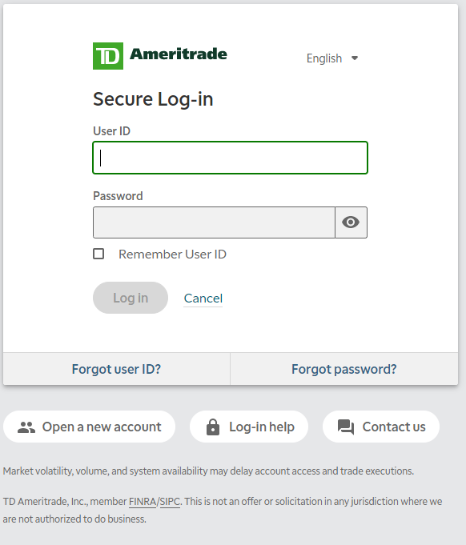
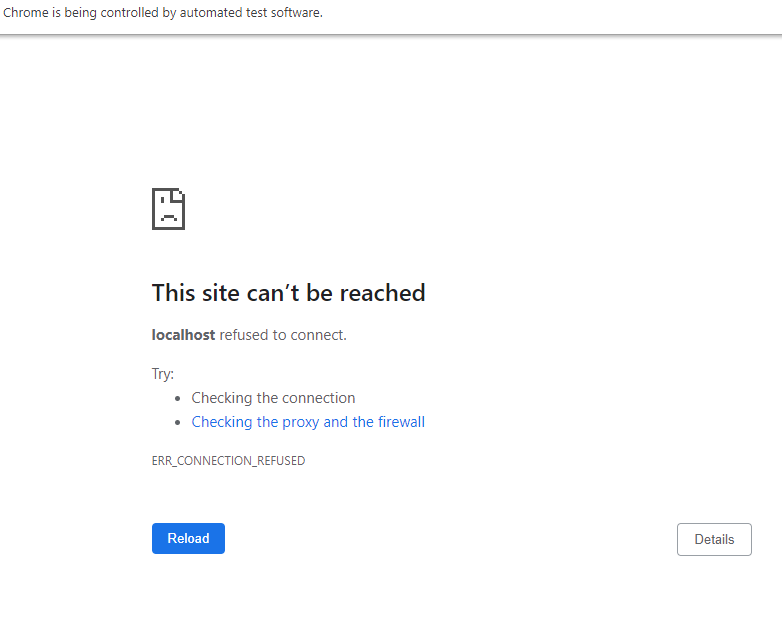

# TDAmeritrade_API_Authenticaton
### This is a simple command program that gets the access token and saves it to a json file. 
> To get this code you have to use the app customer id and the callback URL created when you create an app with https://developer.tdameritrade.com/.
---------------------
> You need to install https://chromedriver.chromium.org/ and https://pypi.org/project/splinter/
---------------------
>* From the console you will be prompted to enter your callback_URL. This should match exactly the calback you have created for your app. eg. http://localhost:8080/
>* Next enter the consumer key found in your app under Keys. 
>* Finaly enter the path where you installed the chrome driver. **This must match exact**. Dont forget to add \chromedriver to the end. eg. C:\Users\\<YOUR_USER>\Desktop\chromedriver_32\chromedriver
>* After entering these, fill out the TD Ameritrade login.
----------------------

>* After you fill out the login inforamtion you will get a url cant be reached. This is what you want. The URL contains your code.

>* At this point go to the console and press enter. The program parses the URL and gets the code.
>* Two json files will be created. one contains the access_token, refresh_token, and other information regarding the token
The other one is a copy of the first code, your callback url, and your customer key. You can use these to make calls to the API.
